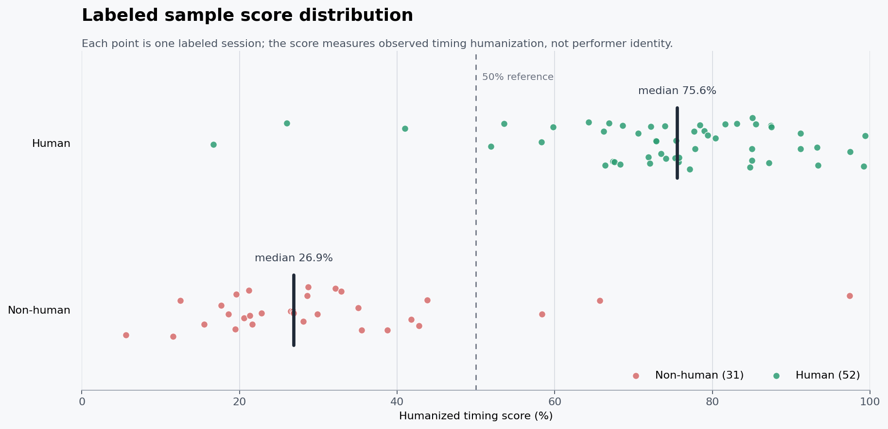

# LyreHelper

LyreHelper is a zero-intervention Windows desktop monitor for music playing through the current default output device. It arms itself at launch, captures the speaker mix through WASAPI loopback, starts a session after sustained signal, and silently archives each completed track after three seconds of silence.

## What it produces

Each session creates three files in `.LyreHelper\\output` below the source working directory, or beside `LyreHelper.exe` in a packaged build:

- `YYYYMMDD_HHMMSS_NNN_audio.wav`: the captured mono PCM audio used by history playback.
- `YYYYMMDD_HHMMSS_NNN_transcription.mid`: transcribed Note On/Note Off events, note velocity, the dynamic tempo map, and beat/downbeat markers on one MIDI timeline.
- `YYYYMMDD_HHMMSS_NNN_chords.csv`: `start_time,end_time,chord_name,key`.

The read-only dashboard shows a live Melodyne-style note roll over a faint spectrum, the raw elastic tempo curve plus a jump-aware causal 30-second moving average, nonuniform beat positions, active chord, key intervals, functional harmony, and timing character score. Each confirmed tempo jump resets the average and breaks the rendered line so adjacent stable sections are never connected by a misleading ramp. Each note event carries its start, end, MIDI pitch, frequency, velocity, and confidence. Use the mouse wheel to move through time, Ctrl+wheel to zoom, drag to pan, Shift-drag to box zoom, and double-click to resume automatic following. No analysis marker can be edited.

Analysis is note-first: the bundled Basic Pitch ONNX model converts real instrument audio into bounded polyphonic note events. Confirmed note starts become equal-weight binary events; detected loudness and MIDI velocity do not participate in tempo, downbeat, key, or chord decisions. Exported MIDI notes use a fixed velocity of 96. A binary percussive-onset fallback is used only when there are too few pitched note starts.

Live analysis transcribes only the newest 12-second window with two seconds of left-edge context. Stable historical notes are retained, while tempo, key, and chord results are recalculated from the accumulated note timeline. Session finalization repeats that same tail-window merge before export instead of replacing stable live results with a separate full-audio transcription. Full-audio analysis is used only as a sparse-note fallback.

Tempo uses an online committed-prefix model. A Viterbi pass segments and stabilizes the mutable 12-second tail with a cost for unnecessary BPM state changes. Older points remain committed except for a bounded cross-boundary repair: a short excursion is removed only when the tempo immediately before and after it returns to the same level. This prevents a formerly multi-point window error from leaving one frozen BPM spike after later frames correct its tail, while sustained changes and gradual human drift remain separate segments. Meter detection is independent of BPM. `3/4/6` estimates use session-level hysteresis and continuous bar phase, so alternating window misclassifications do not move downbeat markers or repartition the tempo curve.

Tempo uses two modes. `CONSTANT-GRID LOCKED` robustly fits all note starts to one global subdivision grid and rejects ornament/outlier events; machine playback therefore produces one fixed BPM. `NEURAL NOTE-DRIVEN` is enabled only when the constant-grid residual is too large and tracks genuine tempo movement. Downbeats use note density, bass-note starts, and harmonic change rather than volume accents.

Pitch labels follow MIDI/scientific pitch notation: MIDI note 60 and 261.63 Hz are displayed as `C4`. Some game assets call the same central C `C3`; that naming difference does not transpose the exported MIDI.

## Install and run

Python 3.11 or newer and Windows are required.

```powershell
python -m venv .venv
.venv\Scripts\python -m pip install -e .
.venv\Scripts\lyrehelper
```

For a generated signal that exercises the dashboard without relying on an output device:

```powershell
.venv\Scripts\lyrehelper --demo
```

Closing the window keeps monitoring in the system tray. Use the tray menu to quit.

The header recording control has `ON`, `OFF`, and `AUTO` modes. `AUTO` uses sustained-signal detection, `ON` records continuously until paused or terminated, and `OFF` keeps capture connected while discarding audio. Pause archives the current session when it contains audio, rejects the next three seconds of captured audio, then rearms `AUTO` without starting a session; only a new signal that satisfies the normal AUTO trigger starts the next archive. Start switches directly to `ON` and cancels any remaining pause. Terminate archives an active session and stays in `OFF` until another mode is selected. Both panels show the current analysis lag. The floating monitor also shows current BPM, BPM range, variance, the latest 12 seconds of notes with beat/downbeat lines, and dedicated Start, Pause, and Terminate controls. Its `H`, `N`, and prohibition buttons mark the current or next session as Human, Non-human, or No Tag. A tagged archive is copied to `.LyreHelper\labels\human` or `.LyreHelper\labels\non_human`; these training copies are not affected by the ten-session output cleanup. The tag resets to No Tag after every finalized or discarded session.

An AUTO signal trigger first opens a rolling five-second candidate window. A session is confirmed when the union of detected note durations occupies at least 15% of any five-second window; overlapping chord notes are counted once. The window keeps sliding, so music that begins near the end of the first five seconds can still qualify. A candidate that never qualifies is discarded when the signal ends, without creating WAV, MIDI, or CSV files. For a confirmed session, non-note material before the first qualifying note is trimmed while retaining 0.2 seconds of lead-in, and audio, MIDI, tempo, and beat timestamps are shifted together. AUTO archives shorter than 20 seconds, measured again after lead-in trimming, are discarded as a second safeguard. Explicit `ON` recordings skip candidate validation and minimum-duration filtering.

AUTO candidate data remains internal: while verification is pending, both dashboards stay at `WAITING FOR AUDIO INPUT` with a stationary, empty timeline. Once note coverage qualifies, the live timeline appears rebased to the same archive origin, 0.2 seconds before the first qualifying note.

After AUTO validation, the same rolling window remains active. If note-duration coverage in the latest five seconds falls below 10%, the session is automatically paused and finalized, followed by the normal three-second cooldown and AUTO rearming.

Live harmonic analysis is bounded to the newest 24 seconds of note context while committed historical tempo, beat, chord, and key segments are retained. Key candidates require repeated confirmation, and segments crossing the mutable-window boundary are trimmed and merged instead of discarded, so the summary retains continuous whole-song key ranges. Chords are emitted only after repeated near-simultaneous attacks provide polyphonic evidence; a monophonic melody remains `N` rather than being forced into augmented or suspended chord templates. The functional-harmony strip compresses repeated chords into Roman numeral, chord-name, harmonic-role, and cadence results for the current key.

When capture blocks are queued, the pipeline catches up to current audio before scheduling another model pass, preventing analysis work from compounding lag. Windows automatically prefer CUDA, then DirectML, then CPU execution; the actual provider is displayed in the main status bar. If only CPU inference is available, the first launch shows one performance warning and records its acknowledgement in settings. Analysis lag is shown in both panels and turns red above five seconds.

Analysis history lists prior archives. Opening an entry reuses the main timeline for its MIDI tempo map, notes, chords, and keys; archived WAV audio can be played from the header. Live capture and automatic recording continue in the background while history is displayed.

## Choose an audio source

Use the speaker button in the top-right corner of the monitor, or choose `Audio input source...` from the tray menu. Select `Follow system default` to track the Windows default output, or select a specific speaker/output endpoint. The choice is saved immediately and WASAPI capture reconnects without restarting the application or interrupting an active analysis session.

## Persistent settings

On first launch LyreHelper creates `%APPDATA%\\LyreHelper\\settings.json` with quiet defaults. It does not show a setup dialog. The audio-source picker updates `device_name` automatically. Set `output_directory` in this file to override the archive path. Manual file changes apply at the next launch. Archives are grouped by session and only the newest 10 sessions are retained; older WAV, MIDI, and CSV files are removed together.

Unsupported devices and device changes are retried silently. Queue pressure switches the session to reduced quality while keeping its timeline continuous. The log is written to `%LOCALAPPDATA%\\LyreHelper\\lyrehelper.log`.

## Verification

```powershell
.venv\Scripts\python -m pytest
```

## Windows installation and startup

LyreHelper targets 64-bit Windows 10/11 and Python 3.11 or newer. Python 3.12 is the tested version. A DirectX 12 GPU is optional: the Windows dependency installs ONNX Runtime DirectML and automatically selects CUDA, DirectML, or CPU in that order according to the providers available at runtime.

Open PowerShell in the project directory and install an isolated editable environment:

```powershell
py -3.12 -m venv .venv
.\.venv\Scripts\python.exe -m pip install --upgrade pip
.\.venv\Scripts\python.exe -m pip install -e .
```

Start the normal monitor with the console launcher:

```powershell
.\.venv\Scripts\lyrehelper.exe
```

For a console-free desktop launch, use `pythonw`:

```powershell
Start-Process .\.venv\Scripts\pythonw.exe -ArgumentList '-m','lyrehelper.app' -WorkingDirectory (Get-Location).Path
```

Use demo capture only for UI and pipeline checks:

```powershell
.\.venv\Scripts\lyrehelper.exe --demo
```

On the first run, LyreHelper creates `%APPDATA%\LyreHelper\settings.json`. Choose the output endpoint from the white speaker icon in the header; `Follow system default` uses the current Windows playback device. Archives default to `.LyreHelper\output` below the source working directory, or beside the packaged EXE. To use another archive directory, close the app and set `output_directory` in `settings.json`. The application retains the newest 10 archive sessions and deletes all files belonging to older sessions automatically.

Closing the main window normally leaves capture running in the notification area. Use `Quit` from the tray menu to stop both capture and analysis. The Start, Pause, and Terminate controls change recording state independently of whether the main or floating window is visible.

After dependency or source updates, refresh the editable install and restart the process:

```powershell
.\.venv\Scripts\python.exe -m pip install -e .
Get-CimInstance Win32_Process |
  Where-Object { $_.CommandLine -match 'lyrehelper' } |
  ForEach-Object { Stop-Process -Id $_.ProcessId -Force }
Start-Process .\.venv\Scripts\pythonw.exe -ArgumentList '-m','lyrehelper.app' -WorkingDirectory (Get-Location).Path
```

The log is `%LOCALAPPDATA%\LyreHelper\lyrehelper.log`. A startup line such as `Neural transcription provider: DmlExecutionProvider` confirms GPU inference. `CPUExecutionProvider` indicates the automatic CPU fallback.

## Humanized timing score

The percentage shown as `HUMANIZED` measures observed timing humanization, not the identity of the performer. It uses note names and note start times only; audio amplitude, detected loudness, and MIDI velocity are excluded.

### BPM variation

Tempo points are split at a confirmed step when the adjacent difference is at least `8 BPM` and at least `8%` of the lower tempo. For each independent segment, the mean and variance are calculated locally. A segment that belongs to a stepped tempo track but is shorter than `10 seconds` is ignored as likely estimator error. The displayed BPM standard deviation is the duration-weighted within-segment value:

```text
variance = sum(segment_duration * segment_variance) / sum(segment_duration)
sigma    = sqrt(variance)
```

This intentionally does not count the distance between two legitimate tempo levels as human fluctuation. The raw tempo curve and the 30-second segmented display remain unchanged. The relative sigma scale used by the sparse/monophonic fallback remains `0.045` (4.5% of average BPM): it is a local-variation normalization, not a weight for whole-song tempo range. The polyphonic calibrated model does not use `bpm_std` directly, so its feature coefficients do not change when this statistic changes. Its tempo behavior features continue to measure sustained and high-frequency movement separately. The tempo evidence is:

```text
tempo_human = clamp(100 * (sigma / average_bpm) / 0.045
                     * (0.65 + 0.35 * abs(lag1_correlation)), 0, 100)
```

### Beat-grid timing

Note starts are projected onto the detected beat timeline. The Grid percentage is the whole-song phase accuracy; the timing deviation is the beat-relative RMS error. A second local error measure removes the phase offset independently in overlapping ten-second windows. For sparse or monophonic material, mechanical evidence is combined conservatively:

```text
mechanical_grid  = sigmoid((Grid - 90) / 1.5)
mechanical_local = sigmoid((5.75 ms - local_error_ms) / 0.75)
mechanical_tempo = 100 - tempo_human
mechanical_total = min(max(mechanical_grid, mechanical_local), mechanical_tempo)
humanized        = 100 - mechanical_total
```

Thus a precise grid alone cannot make a recording human, and a variable BPM alone cannot make it human.

### Polyphonic articulation

When at least twelve repeated multi-note attacks are available, the score uses the calibrated polyphonic model instead of the sparse fallback. Its twelve normalized inputs are:

- tempo: median and P90 adjacent BPM movement, locally stable-step ratio, high-frequency tempo motion, and low-frequency tempo motion;
- beat placement: Grid accuracy and timing deviation normalized by local beat duration;
- articulation: exact synchronized-attack ratio, multi-note onset ratio, median attack spread, P90 attack spread, and repeated pitch-pair onset-offset MAD.

Each input is standardized with the protected labeled corpus, then combined by the fixed logistic calibration:

```text
z_i       = (feature_i - calibration_mean_i) / calibration_scale_i
calibrated = 100 * sigmoid(0.335035536850 + sum(coefficient_i * z_i))
```

The coefficients and calibration vectors are kept in `analysis.py`. A separate joint-evidence floor/ceiling check can raise the result only when both sustained tempo motion and loose Grid timing are present:

```text
joint = min(sigmoid((tempo_step_p90 - 0.030) / 0.0075),
            sigmoid((grid_error - 0.150) / 0.025))
humanized = max(calibrated, 100 * joint)
```

The final value is clamped to `0-100%`. Missing articulation evidence uses the sparse fallback rather than treating absent chord attacks as perfectly mechanical. The score is a timing-character indicator; a highly accurate human and deliberately humanized playback can remain observationally ambiguous.



The distribution is regenerated from the latest labeled manifest and replaces the same `docs/score-distribution.png` file each time.

## Build the Windows executable

The supported package is an `onedir` build so PySide6, ONNX Runtime provider DLLs, and the bundled transcription model remain directly loadable. From PowerShell in the project directory:

```powershell
.\tools\build_windows.ps1
```

The script installs PyInstaller into `.venv` without reinstalling or stopping a running LyreHelper process, cleans the previous PyInstaller work directory, packages the application, and verifies that the packaged ONNX model can create an inference session before reporting success. It produces:

```text
dist\LyreHelper\LyreHelper.exe
```

For repeat builds after dependencies are already installed:

```powershell
.\tools\build_windows.ps1 -SkipInstall
```

Distribute the complete `dist\LyreHelper` directory, not only the EXE. Packaged recordings and labels default to `dist\LyreHelper\.LyreHelper`; settings and logs remain in the standard `%APPDATA%` and `%LOCALAPPDATA%` locations.

The performance score is calibrated from several independent timing features rather than BPM variance or Grid alone. It uses relative median/P90 BPM movement, the proportion of locally stable tempo steps, low- and high-frequency tempo motion, beat-relative Grid error, and polyphonic attack synchronization. Chord articulation includes both the P90 attack spread and the repeatability of the relative onset offset for the same pitch pair; this preserves occasional rolled or uneven attacks that a median-only feature hides. A separate fuzzy conjunction can raise Humanized evidence only when sustained tempo motion and loose beat placement are both present, so a programmed tempo map or a loose grid cannot override the other evidence by itself. All timing values are normalized by local beat duration. No amplitude or velocity feature participates. When multi-note attack evidence is unavailable, the fitted global/local Grid is treated as one evidence family and must be corroborated by stable tempo before monophonic material can be called mechanical. The percentage describes timing humanization, not a guaranteed performer-identity probability; highly accurate humans and deliberately humanized scripts can remain observationally ambiguous.

Optional external instrument tests do not require sample libraries in the repository. Set `LYREHELPER_TEST_SAMPLE_DIR` to a local WAV library to enable `tests/test_real_instruments.py`; without it, those two integration tests are skipped. To render a MIDI manually, pass `--samples <directory>` to `tools/render_midi_with_samples.py`, or set `LYREHELPER_SAMPLE_DIR`. The generated WAV is local output and is ignored by `.gitignore`.
